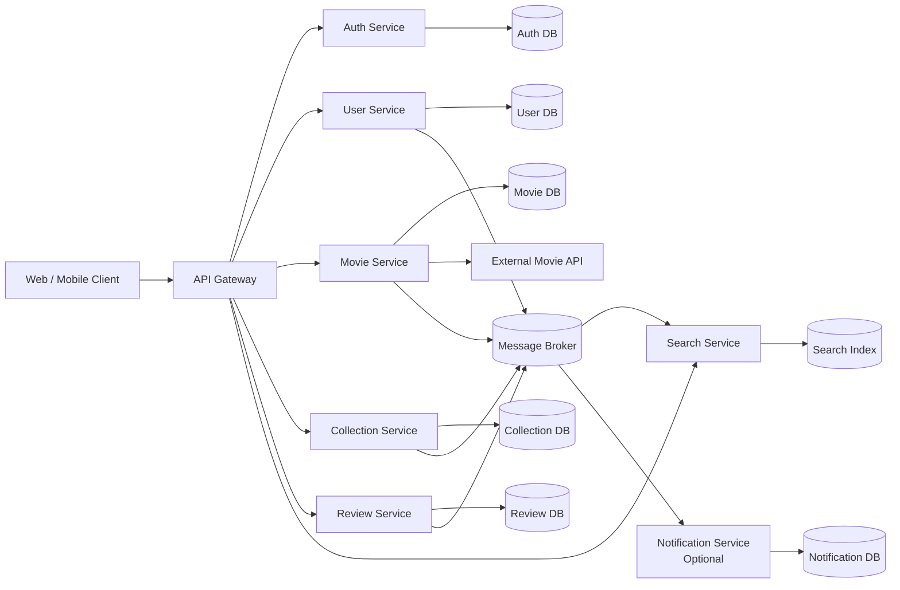
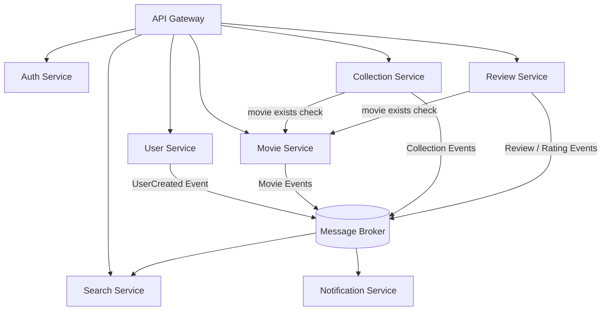
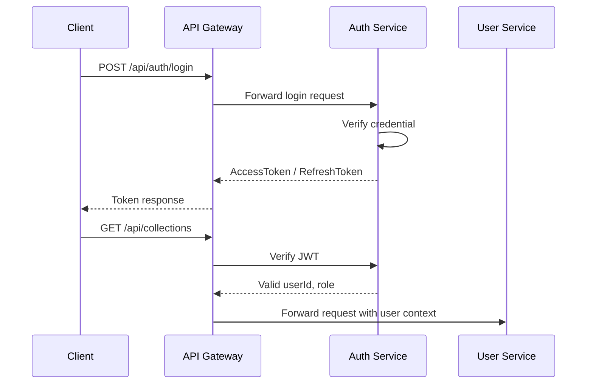
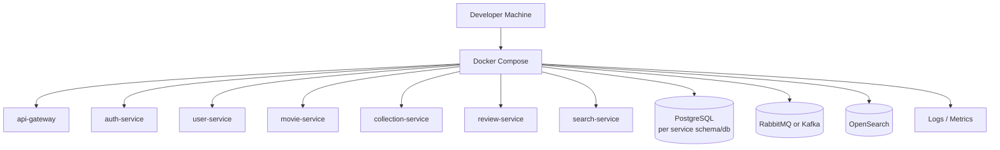

아래 설계는 첨부하신 **Design Agent Persona/System Prompt**의 산출물 구조를 따르고, 이전 요구사항 분석 산출물의 핵심 원칙인 **서비스 책임 경계 명확화, 서비스 간 의존성 최소화, 서비스별 독립 DB, API/Event 기반 통신**을 기준으로 작성했습니다. Design Agent는 서비스별 책임, 소유 데이터, API, 연동 방식, 장애 영향 범위까지 정의하도록 되어 있으며, DB 직접 참조 금지와 이벤트 기반 동기화를 중요한 설계 원칙으로 제시합니다.  

---

# 영화 컬렉션 관리 시스템 MSA 설계서

## 1. 아키텍처 목표

### 1.1 설계 목표

**영화 컬렉션 관리 시스템**은 사용자가 영화 정보를 조회하고, 개인 컬렉션을 구성하며, 리뷰와 평점을 작성하고, 영화 검색을 수행할 수 있는 서비스입니다.

MSA 설계의 핵심 목표는 다음과 같습니다.

| 목표            | 설명                                                    |
| ------------- | ----------------------------------------------------- |
| 서비스 책임 경계 명확화 | User, Auth, Movie, Collection, Review, Search의 책임을 분리 |
| 의존성 최소화       | 서비스 간 직접 DB 접근 금지, API 또는 Event 기반 연동                 |
| 독립 배포 가능성     | 각 서비스는 독립적으로 빌드, 테스트, 배포 가능                           |
| 장애 격리         | Review 장애가 Movie 조회 전체를 중단시키지 않도록 설계                  |
| 확장성           | 검색, 리뷰, 영화 조회 등 트래픽이 많은 기능을 독립 확장                     |
| 데이터 소유권 명확화   | 각 데이터의 원천 소유 서비스를 명확히 지정                              |
| 관측 가능성        | 로그, 메트릭, 트레이싱 기반 운영 구조 확보                             |

---

## 2. 전체 시스템 구성

## 2.1 주요 구성 요소

```text
Client
 └── API Gateway
      ├── Auth Service
      ├── User Service
      ├── Movie Service
      ├── Collection Service
      ├── Review Service
      ├── Search Service
      └── Notification Service(Optional)

Message Broker
 ├── MovieCreated / MovieUpdated / MovieDeleted
 ├── ReviewCreated / RatingUpdated
 ├── CollectionCreated / CollectionUpdated
 └── UserCreated
```

## 2.2 전체 아키텍처 다이어그램



이 구조에서 **Gateway는 외부 진입점**, 각 서비스는 **자신의 DB만 소유**, Search Service는 원천 데이터가 아니라 **검색 인덱스만 소유**합니다. 이전 요구사항 분석에서도 핵심 서비스 후보로 API Gateway, Auth, User, Movie, Collection, Review, Search가 제시되었고, Search는 Movie/Review 이벤트를 구독하는 구조로 정리되어 있습니다. 

---

## 3. 서비스 분해 구조

## 3.1 핵심 서비스

| 서비스                  | 책임                        | 소유 데이터         | 외부 공개 여부            |
| -------------------- | ------------------------- | -------------- | ------------------- |
| API Gateway          | 요청 라우팅, 인증 필터, Rate Limit | 없음             | Public              |
| Auth Service         | 로그인, 토큰 발급, 권한 검증         | 인증 정보, 권한      | Internal/Public 일부  |
| User Service         | 사용자 프로필 관리                | 사용자 프로필        | Protected           |
| Movie Service        | 영화 기준 정보 관리               | 영화, 장르, 감독, 배우 | Public/Protected    |
| Collection Service   | 사용자 컬렉션 관리                | 컬렉션, 컬렉션 항목    | Protected           |
| Review Service       | 리뷰, 평점 관리                 | 리뷰, 평점         | Protected/Public 일부 |
| Search Service       | 영화 검색 인덱스 관리              | 검색 인덱스         | Public              |
| Notification Service | 이벤트 기반 알림                 | 알림 이력          | Internal/Protected  |

---

## 3.2 서비스 분리 원칙

| 원칙           | 적용 방식                                 |
| ------------ | ------------------------------------- |
| 단일 책임 원칙     | Movie Service는 영화 기준 데이터만 관리          |
| 데이터 소유권 분리   | Review Service는 리뷰/평점만 소유             |
| 직접 DB 접근 금지  | Collection Service는 Movie DB를 조회하지 않음 |
| API/Event 연동 | 실시간 검증은 REST, 상태 전파는 Event            |
| 순환 의존성 금지    | Movie → Collection 호출 금지              |
| 장애 격리        | Search 장애 시 Movie CRUD는 계속 가능         |

---

## 4. 서비스별 상세 설계

## 4.1 API Gateway

| 항목     | 설계                                            |
| ------ | --------------------------------------------- |
| 서비스명   | api-gateway                                   |
| 책임     | 외부 요청 진입점, 라우팅, 인증 필터, Rate Limiting          |
| 소유 데이터 | 없음                                            |
| 주요 기능  | 라우팅, JWT 검증 위임, CORS, Request Logging         |
| 연동 서비스 | Auth, User, Movie, Collection, Review, Search |
| 통신 방식  | REST                                          |
| 장애 영향  | Gateway 장애 시 외부 전체 접근 불가                      |

### 주요 라우팅

| 외부 경로                 | 내부 서비스             |
| --------------------- | ------------------ |
| `/api/auth/**`        | Auth Service       |
| `/api/users/**`       | User Service       |
| `/api/movies/**`      | Movie Service      |
| `/api/collections/**` | Collection Service |
| `/api/reviews/**`     | Review Service     |
| `/api/search/**`      | Search Service     |

---

## 4.2 Auth Service

| 항목     | 설계                                 |
| ------ | ---------------------------------- |
| 서비스명   | auth-service                       |
| 책임     | 인증, 토큰 발급, 권한 검증                   |
| 소유 데이터 | AuthCredential, Role, RefreshToken |
| 주요 기능  | 로그인, 로그아웃, 토큰 재발급, 권한 검증           |
| 연동 서비스 | User Service                       |
| 통신 방식  | REST + Event 구독                    |
| 장애 영향  | 로그인 및 보호 API 접근 제한                 |

### 책임 경계

Auth Service는 **인증과 권한 판단만 담당**합니다.

관리하지 않는 데이터:

```text
사용자 프로필
영화 데이터
컬렉션 데이터
리뷰 데이터
평점 데이터
```

### 주요 API

| Method | Endpoint               | 설명        | 인증       |
| ------ | ---------------------- | --------- | -------- |
| POST   | `/auth/login`          | 로그인       | Public   |
| POST   | `/auth/logout`         | 로그아웃      | Required |
| POST   | `/auth/refresh`        | 토큰 재발급    | Public   |
| GET    | `/auth/verify`         | 토큰 검증     | Internal |
| GET    | `/auth/roles/{userId}` | 사용자 권한 조회 | Internal |

---

## 4.3 User Service

| 항목     | 설계                                 |
| ------ | ---------------------------------- |
| 서비스명   | user-service                       |
| 책임     | 사용자 기본 정보 관리                       |
| 소유 데이터 | UserProfile                        |
| 주요 기능  | 회원 가입, 프로필 조회, 프로필 수정, 회원 비활성화     |
| 연동 서비스 | Auth Service, Notification Service |
| 통신 방식  | REST + Event 발행                    |
| 장애 영향  | 사용자 프로필 조회/수정 불가                   |

### 책임 경계

User Service는 **사용자 프로필**만 관리합니다.

관리하지 않는 데이터:

```text
비밀번호 인증 정보
토큰
리뷰
평점
컬렉션
영화 정보
```

### 주요 API

| Method | Endpoint                  | 설명           | 인증       |
| ------ | ------------------------- | ------------ | -------- |
| POST   | `/users`                  | 회원 가입        | Public   |
| GET    | `/users/me`               | 내 프로필 조회     | Required |
| PATCH  | `/users/me`               | 내 프로필 수정     | Required |
| DELETE | `/users/me`               | 회원 탈퇴 요청     | Required |
| GET    | `/users/{userId}/summary` | 사용자 요약 정보 조회 | Internal |

### 발행 이벤트

```text
UserCreated
UserUpdated
UserDeactivated
```

---

## 4.4 Movie Service

| 항목     | 설계                                    |
| ------ | ------------------------------------- |
| 서비스명   | movie-service                         |
| 책임     | 영화 기준 정보 관리                           |
| 소유 데이터 | Movie, Genre, Actor, Director         |
| 주요 기능  | 영화 등록, 수정, 삭제, 조회                     |
| 연동 서비스 | External Movie API, Search Service    |
| 통신 방식  | REST + Event 발행                       |
| 장애 영향  | 영화 등록/조회 불가, 단 Search 캐시 조회는 가능할 수 있음 |

### 책임 경계

Movie Service는 **영화 메타데이터의 원천 소유자**입니다.

관리하지 않는 데이터:

```text
사용자 컬렉션 포함 여부
사용자 리뷰
사용자 평점
즐겨찾기
시청 상태
```

### 주요 API

| Method | Endpoint                   | 설명            | 인증       |
| ------ | -------------------------- | ------------- | -------- |
| POST   | `/movies`                  | 영화 등록         | Admin    |
| GET    | `/movies`                  | 영화 목록 조회      | Public   |
| GET    | `/movies/{movieId}`        | 영화 상세 조회      | Public   |
| PATCH  | `/movies/{movieId}`        | 영화 정보 수정      | Admin    |
| DELETE | `/movies/{movieId}`        | 영화 삭제 또는 비활성화 | Admin    |
| GET    | `/movies/{movieId}/exists` | 영화 존재 여부 확인   | Internal |

### 발행 이벤트

```text
MovieCreated
MovieUpdated
MovieDeleted
MovieImported
```

---

## 4.5 Collection Service

| 항목     | 설계                         |
| ------ | -------------------------- |
| 서비스명   | collection-service         |
| 책임     | 사용자별 영화 컬렉션 관리             |
| 소유 데이터 | Collection, CollectionItem |
| 주요 기능  | 컬렉션 생성, 수정, 삭제, 영화 추가/제거   |
| 연동 서비스 | Movie Service              |
| 통신 방식  | REST + Event 발행            |
| 장애 영향  | 컬렉션 기능 사용 불가, 영화 조회는 영향 없음 |

### 책임 경계

Collection Service는 **User-Movie 관계 데이터**만 관리합니다.

관리하지 않는 데이터:

```text
영화 제목
영화 장르
리뷰
평점
사용자 프로필 상세
```

컬렉션 항목에는 `movieId`만 저장하고, 영화 상세 정보는 필요 시 Movie Service 또는 Search Service를 통해 조회합니다.

### 주요 API

| Method | Endpoint                                      | 설명          | 인증       |
| ------ | --------------------------------------------- | ----------- | -------- |
| POST   | `/collections`                                | 컬렉션 생성      | Required |
| GET    | `/collections`                                | 내 컬렉션 목록 조회 | Required |
| GET    | `/collections/{collectionId}`                 | 컬렉션 상세 조회   | Required |
| PATCH  | `/collections/{collectionId}`                 | 컬렉션 수정      | Required |
| DELETE | `/collections/{collectionId}`                 | 컬렉션 삭제      | Required |
| POST   | `/collections/{collectionId}/items`           | 영화 추가       | Required |
| DELETE | `/collections/{collectionId}/items/{movieId}` | 영화 제거       | Required |

### 발행 이벤트

```text
CollectionCreated
CollectionUpdated
CollectionDeleted
CollectionItemAdded
CollectionItemRemoved
```

---

## 4.6 Review Service

| 항목     | 설계                            |
| ------ | ----------------------------- |
| 서비스명   | review-service                |
| 책임     | 영화 리뷰와 평점 관리                  |
| 소유 데이터 | Review, Rating                |
| 주요 기능  | 리뷰 작성/수정/삭제, 평점 등록, 영화별 리뷰 조회 |
| 연동 서비스 | Movie Service, Search Service |
| 통신 방식  | REST + Event 발행               |
| 장애 영향  | 리뷰/평점 기능 불가, 영화 조회는 계속 가능     |

### 책임 경계

Review Service는 **리뷰와 평점의 원천 소유자**입니다.

관리하지 않는 데이터:

```text
영화 메타데이터
사용자 프로필
컬렉션 포함 여부
검색 인덱스
```

### 주요 API

| Method | Endpoint                             | 설명         | 인증       |
| ------ | ------------------------------------ | ---------- | -------- |
| POST   | `/reviews`                           | 리뷰 작성      | Required |
| GET    | `/reviews?movieId={movieId}`         | 영화별 리뷰 조회  | Public   |
| GET    | `/reviews/me`                        | 내 리뷰 목록 조회 | Required |
| PATCH  | `/reviews/{reviewId}`                | 리뷰 수정      | Required |
| DELETE | `/reviews/{reviewId}`                | 리뷰 삭제      | Required |
| POST   | `/ratings`                           | 평점 등록/수정   | Required |
| GET    | `/ratings/summary?movieId={movieId}` | 평균 평점 조회   | Public   |

### 발행 이벤트

```text
ReviewCreated
ReviewUpdated
ReviewDeleted
RatingCreated
RatingUpdated
RatingDeleted
```

---

## 4.7 Search Service

| 항목     | 설계                                   |
| ------ | ------------------------------------ |
| 서비스명   | search-service                       |
| 책임     | 영화 검색 및 필터링                          |
| 소유 데이터 | SearchIndex                          |
| 주요 기능  | 제목, 장르, 감독, 배우, 연도, 평점 기반 검색         |
| 연동 서비스 | Movie Service, Review Service 이벤트 구독 |
| 통신 방식  | REST + Event 구독                      |
| 장애 영향  | 검색 기능 불가, 영화 상세 조회는 가능               |

### 책임 경계

Search Service는 **원천 데이터를 소유하지 않습니다.**

원천 데이터 소유자는 다음과 같습니다.

| 데이터               | 원천 소유 서비스          |
| ----------------- | ------------------ |
| 영화 제목, 장르, 감독, 배우 | Movie Service      |
| 평균 평점, 리뷰 수       | Review Service     |
| 컬렉션 포함 여부         | Collection Service |

Search Service는 이벤트를 통해 필요한 데이터를 복제하여 **검색용 인덱스**만 관리합니다.

### 주요 API

| Method | Endpoint                            | 설명        | 인증     |
| ------ | ----------------------------------- | --------- | ------ |
| GET    | `/search/movies?q={keyword}`        | 영화 키워드 검색 | Public |
| GET    | `/search/movies?genre={genre}`      | 장르 검색     | Public |
| GET    | `/search/movies?year={year}`        | 개봉연도 검색   | Public |
| GET    | `/search/movies?actor={actor}`      | 배우 검색     | Public |
| GET    | `/search/movies?minRating={rating}` | 평점 기반 검색  | Public |

---

## 4.8 Notification Service

| 항목     | 설계                      |
| ------ | ----------------------- |
| 서비스명   | notification-service    |
| 책임     | 이벤트 기반 알림               |
| 소유 데이터 | NotificationLog         |
| 주요 기능  | 가입 알림, 리뷰 알림, 컬렉션 공유 알림 |
| 연동 서비스 | Message Broker          |
| 통신 방식  | Event 구독                |
| 장애 영향  | 알림만 실패, 핵심 기능 영향 없음     |

Notification Service는 MVP에서는 Optional입니다. 요구사항 분석에서도 알림은 확장 후보 서비스로 분리되어 있으며, 리뷰 알림이나 컬렉션 공유 알림 등 기능이 추가될 때 분리하는 것이 적합합니다. 

---

## 5. API Gateway 설계

## 5.1 Gateway 책임

```text
1. 외부 요청 단일 진입점 제공
2. 서비스별 라우팅
3. JWT 인증 필터 적용
4. 관리자 권한 검증
5. Rate Limiting
6. 공통 Request/Response Logging
7. 장애 시 표준 Error Response 반환
```

## 5.2 인증 필요 API 구분

| API 영역       | 인증 필요 여부 |
| ------------ | -------- |
| 회원 가입        | Public   |
| 로그인          | Public   |
| 영화 목록 조회     | Public   |
| 영화 상세 조회     | Public   |
| 영화 검색        | Public   |
| 컬렉션 생성/수정/삭제 | Required |
| 리뷰 작성/수정/삭제  | Required |
| 평점 등록        | Required |
| 영화 등록/수정/삭제  | Admin    |
| 관리자 리뷰 관리    | Admin    |

---

## 6. 서비스 간 통신 설계

## 6.1 통신 원칙

Design Agent Prompt는 실시간 조회에는 REST, 상태 변경 이벤트나 알림에는 Message Broker 기반 비동기 통신을 고려하도록 정의합니다. 

| 상황        | 통신 방식       | 예시                           |
| --------- | ----------- | ---------------------------- |
| 즉시 검증 필요  | REST Sync   | Collection → Movie 존재 여부 확인  |
| 검색 인덱스 갱신 | Event Async | MovieCreated → Search        |
| 알림 발송     | Event Async | ReviewCreated → Notification |
| 권한 확인     | REST Sync   | Gateway → Auth               |
| 장애 격리 필요  | Event Async | Review 변경 → Search 반영        |

---

## 6.2 서비스 의존성 방향



## 6.3 금지되는 의존성

```text
Collection Service → Movie DB 직접 조회 금지
Review Service → User DB 직접 조회 금지
Search Service → Movie DB 직접 Join 금지
Movie Service → Collection Service 직접 호출 지양
Movie Service → Review Service 직접 호출 지양
```

이전 요구사항 산출물에서도 DB Join 대신 API 호출 또는 이벤트 기반 복제를 사용하고, Search Service는 Movie/Review 이벤트를 구독해 인덱스를 갱신하는 구조가 권장되어 있습니다. 

---

## 7. 데이터베이스 설계

## 7.1 Database per Service 원칙

| 서비스                  | DB              | 주요 테이블/컬렉션                                     |
| -------------------- | --------------- | ---------------------------------------------- |
| Auth Service         | auth_db         | auth_credentials, roles, refresh_tokens        |
| User Service         | user_db         | users, user_profiles                           |
| Movie Service        | movie_db        | movies, genres, actors, directors, movie_casts |
| Collection Service   | collection_db   | collections, collection_items                  |
| Review Service       | review_db       | reviews, ratings                               |
| Search Service       | search_index    | movie_search_documents                         |
| Notification Service | notification_db | notification_logs                              |

각 서비스는 자신의 DB만 직접 접근합니다. 다른 서비스의 데이터가 필요하면 다음 중 하나를 사용합니다.

```text
1. REST API 호출
2. Event 구독 후 로컬 read model 생성
3. Gateway 또는 BFF에서 여러 서비스 응답 조합
```

---

## 7.2 핵심 엔티티 설계

### User Service

```text
User
- id
- email
- name
- nickname
- profileImageUrl
- status
- createdAt
- updatedAt
```

### Auth Service

```text
AuthCredential
- id
- userId
- email
- passwordHash
- role
- status
- lastLoginAt
```

### Movie Service

```text
Movie
- id
- title
- originalTitle
- description
- releaseYear
- runningTime
- posterUrl
- status
- createdAt
- updatedAt
```

### Collection Service

```text
Collection
- id
- userId
- name
- description
- visibility
- createdAt
- updatedAt

CollectionItem
- id
- collectionId
- movieId
- addedAt
```

### Review Service

```text
Review
- id
- userId
- movieId
- content
- status
- createdAt
- updatedAt

Rating
- id
- userId
- movieId
- score
- createdAt
- updatedAt
```

### Search Service

```text
MovieSearchDocument
- movieId
- title
- genres
- actors
- directors
- releaseYear
- averageRating
- reviewCount
- posterUrl
- updatedAt
```

---

## 8. 이벤트 설계

## 8.1 이벤트 목록

| 이벤트                 | 발행 서비스             | 구독 서비스               | 목적              |
| ------------------- | ------------------ | -------------------- | --------------- |
| UserCreated         | User Service       | Auth, Notification   | 인증 정보 생성, 가입 알림 |
| UserUpdated         | User Service       | Notification         | 사용자 정보 변경 알림    |
| MovieCreated        | Movie Service      | Search               | 검색 인덱스 생성       |
| MovieUpdated        | Movie Service      | Search               | 검색 인덱스 갱신       |
| MovieDeleted        | Movie Service      | Search, Collection   | 비활성 영화 반영       |
| CollectionCreated   | Collection Service | Notification         | 컬렉션 생성 알림       |
| CollectionItemAdded | Collection Service | Notification         | 컬렉션 변경 알림       |
| ReviewCreated       | Review Service     | Search, Notification | 리뷰 수, 평점 정보 반영  |
| ReviewDeleted       | Review Service     | Search               | 리뷰 수 재계산        |
| RatingUpdated       | Review Service     | Search               | 평균 평점 갱신        |

이전 요구사항 분석에서도 `MovieCreated`, `MovieUpdated`, `ReviewCreated`, `RatingUpdated`와 같은 이벤트를 통해 Search Service와 Notification Service가 갱신되는 구조가 제안되어 있습니다. 

---

## 8.2 이벤트 메시지 예시

### MovieCreated

```json
{
  "eventId": "evt-001",
  "eventType": "MovieCreated",
  "occurredAt": "2026-05-12T10:00:00+09:00",
  "source": "movie-service",
  "payload": {
    "movieId": "movie-1001",
    "title": "Inception",
    "genres": ["Sci-Fi", "Thriller"],
    "releaseYear": 2010,
    "posterUrl": "https://example.com/poster.jpg"
  }
}
```

### ReviewCreated

```json
{
  "eventId": "evt-002",
  "eventType": "ReviewCreated",
  "occurredAt": "2026-05-12T10:05:00+09:00",
  "source": "review-service",
  "payload": {
    "reviewId": "review-9001",
    "movieId": "movie-1001",
    "userId": "user-101",
    "rating": 4.5
  }
}
```

---

## 9. 인증/인가 설계

## 9.1 인증 흐름



## 9.2 권한 모델

| Role   | 권한                          |
| ------ | --------------------------- |
| USER   | 영화 조회, 검색, 컬렉션 관리, 리뷰/평점 작성 |
| ADMIN  | 영화 등록/수정/삭제, 리뷰 관리          |
| SYSTEM | 서비스 간 내부 API 호출             |

## 9.3 인증 정보 전달

Gateway는 인증 성공 후 내부 서비스로 다음 Header를 전달합니다.

```text
X-User-Id: user-101
X-User-Role: USER
X-Request-Id: req-20260512-001
```

내부 서비스는 JWT를 직접 해석하기보다 Gateway에서 검증된 사용자 컨텍스트를 우선 사용합니다.

---

## 10. 로그 및 모니터링 설계

## 10.1 로그 설계

모든 서비스는 다음 공통 필드를 포함해 로그를 남깁니다.

```text
timestamp
serviceName
requestId
userId
method
path
statusCode
latencyMs
errorCode
message
```

## 10.2 모니터링 지표

| 항목     | 지표                                      |
| ------ | --------------------------------------- |
| API 성능 | p95 latency, p99 latency                |
| 장애율    | 4xx/5xx 비율                              |
| 서비스 상태 | Health Check, Readiness                 |
| 이벤트 처리 | Consumer lag, event retry count         |
| DB 상태  | Connection count, slow query            |
| 검색 상태  | Index update delay                      |
| 인증 상태  | Login failure rate, token refresh count |

## 10.3 분산 추적

서비스 간 호출에는 `X-Request-Id` 또는 `Trace-Id`를 전달하여 다음 흐름을 추적합니다.

```text
Client → API Gateway → Collection Service → Movie Service
Client → API Gateway → Review Service → Message Broker → Search Service
```

---

## 11. 장애 격리 및 복구 전략

## 11.1 장애 격리 원칙

| 장애 서비스               | 영향 범위           | 격리 전략                         |
| -------------------- | --------------- | ----------------------------- |
| Auth Service         | 로그인 및 보호 API 제한 | Gateway 캐시 검증, 짧은 장애 허용 정책    |
| User Service         | 프로필 조회/수정 실패    | 핵심 영화 조회에는 영향 없음              |
| Movie Service        | 영화 원천 조회 실패     | Search 인덱스 기반 목록 검색 일부 가능     |
| Collection Service   | 컬렉션 기능 불가       | 영화 조회, 검색, 리뷰는 정상             |
| Review Service       | 리뷰/평점 기능 불가     | 영화 상세 조회는 리뷰 없이 제공            |
| Search Service       | 검색 불가           | Movie Service 목록 조회로 fallback |
| Notification Service | 알림 실패           | 핵심 비즈니스 기능 영향 없음              |
| Message Broker       | 이벤트 전파 지연       | Outbox 패턴, 재처리 큐 사용           |

---

## 11.2 장애 대응 패턴

| 패턴                 | 적용 위치                              | 설명                   |
| ------------------ | ---------------------------------- | -------------------- |
| Timeout            | 모든 서비스 간 REST 호출                   | 장시간 대기 방지            |
| Circuit Breaker    | Collection → Movie, Review → Movie | 장애 전파 차단             |
| Retry with Backoff | 이벤트 발행/소비                          | 일시 장애 재시도            |
| Outbox Pattern     | Movie, Review, Collection          | DB 변경과 이벤트 발행 정합성 보장 |
| Dead Letter Queue  | Message Broker                     | 실패 이벤트 보관            |
| Fallback Response  | Gateway/Search                     | 검색 장애 시 기본 목록 조회     |

---

## 12. 배포 구조

## 12.1 Docker Compose 기반 개발 환경



## 12.2 운영 환경 확장 구조

```text
Kubernetes Namespace: movie-collection

Deployments
- api-gateway
- auth-service
- user-service
- movie-service
- collection-service
- review-service
- search-service
- notification-service

Stateful Components
- auth-db
- user-db
- movie-db
- collection-db
- review-db
- opensearch
- message-broker

Observability
- Prometheus
- Grafana
- Loki or ELK
- OpenTelemetry Collector
```

---

## 13. Coding Agent에게 전달할 구현 지침

## 13.1 권장 기술 스택

| 영역             | 권장 기술                                                 |
| -------------- | ----------------------------------------------------- |
| Backend        | Spring Boot 또는 FastAPI                                |
| API Gateway    | Spring Cloud Gateway, Kong, NGINX, 또는 FastAPI Gateway |
| DB             | PostgreSQL                                            |
| Search         | OpenSearch 또는 Elasticsearch                           |
| Message Broker | RabbitMQ 또는 Kafka                                     |
| Auth           | JWT + Refresh Token                                   |
| Container      | Docker, Docker Compose                                |
| Observability  | OpenTelemetry, Prometheus, Grafana                    |
| Test           | Pytest/JUnit, Postman/Newman, Testcontainers          |

---

## 13.2 서비스별 디렉터리 구조 예시

```text
movie-collection-system/
├── api-gateway/
├── auth-service/
├── user-service/
├── movie-service/
├── collection-service/
├── review-service/
├── search-service/
├── notification-service/
├── common/
│   ├── error/
│   ├── event/
│   ├── logging/
│   └── security/
├── infra/
│   ├── docker-compose.yml
│   ├── gateway/
│   ├── broker/
│   ├── db/
│   └── monitoring/
└── docs/
    ├── srs/
    ├── design/
    ├── api/
    └── test/
```

---

## 13.3 구현 우선순위

### Phase 1: MVP 핵심 기능

```text
1. API Gateway
2. Auth Service
3. User Service
4. Movie Service
5. Collection Service
6. Review Service
7. Search Service 기본 검색
```

### Phase 2: 이벤트 기반 확장

```text
1. MovieCreated → Search 인덱스 생성
2. MovieUpdated → Search 인덱스 갱신
3. ReviewCreated → Search 평균 평점 반영
4. RatingUpdated → Search 평점 정보 갱신
```

### Phase 3: 운영 기능

```text
1. Notification Service
2. 관리자 리뷰 관리
3. 외부 영화 API 연동
4. 로그/모니터링 대시보드
5. 장애 복구 및 DLQ 처리
```

---

## 13.4 Coding Agent 구현 원칙

```text
1. 서비스별 독립 실행 가능
2. 서비스별 DB 독립 구성
3. 다른 서비스 DB 직접 접근 금지
4. REST API는 OpenAPI 문서 자동 생성
5. 이벤트 메시지는 공통 스키마 사용
6. 서비스 간 순환 호출 금지
7. Controller / Service / Repository / DTO 계층 분리
8. 공통 에러 응답 형식 통일
9. Request ID 기반 로깅 적용
10. 단위 테스트와 통합 테스트 Skeleton 포함
```

---

# 최종 설계 요약

이번 MSA 설계의 핵심은 다음 구조입니다.

```text
API Gateway
 ├── Auth Service          : 인증/인가
 ├── User Service          : 사용자 프로필
 ├── Movie Service         : 영화 기준 데이터
 ├── Collection Service    : 사용자-영화 컬렉션 관계
 ├── Review Service        : 리뷰/평점
 ├── Search Service        : 검색 인덱스
 └── Notification Service  : 이벤트 기반 알림
```

가장 중요한 설계 원칙은 다음 5가지입니다.

```text
1. Movie Service는 영화 기준 데이터만 소유한다.
2. Review Service는 리뷰와 평점만 소유한다.
3. Collection Service는 User-Movie 관계만 소유한다.
4. Search Service는 원천 데이터가 아니라 검색 인덱스만 소유한다.
5. 서비스 간 데이터 연동은 직접 DB 조회가 아니라 REST API 또는 Event로 처리한다.
```
