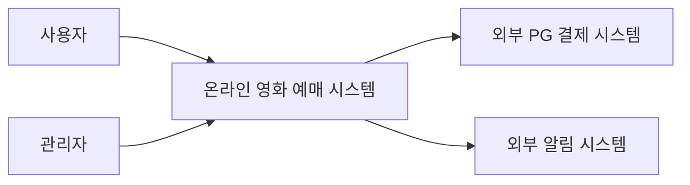
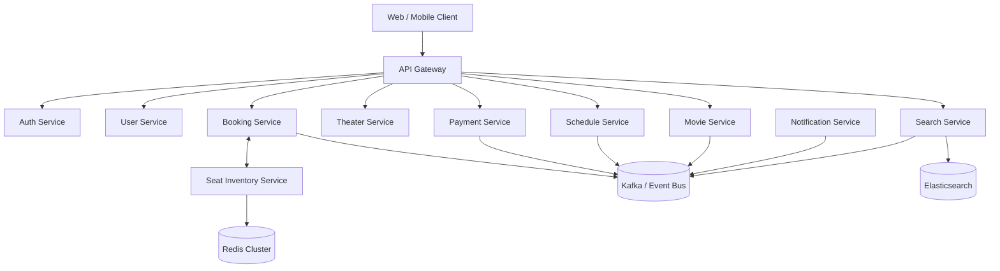
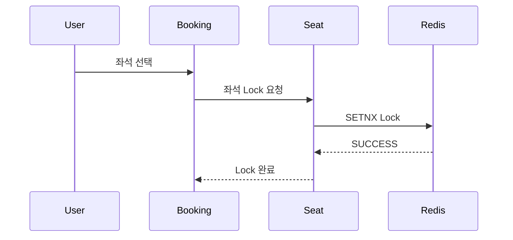
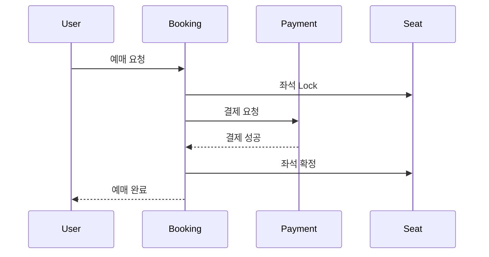

# 온라인 영화 예매 시스템 — 기본 설계 (MSA 기반)

# 1. 설계 목표

본 시스템은 다음 목표를 만족하도록 설계한다.

* 대규모 트래픽 대응
* 독립 배포 가능
* 장애 격리
* 서비스별 독립 확장
* 좌석 예매 정합성 보장
* 이벤트 기반 비동기 처리
* 운영/관측성 확보

특히:

* 좌석 동시성
* 결제 정합성
* 예매 오픈 트래픽 폭증

을 핵심 고려사항으로 설계한다.

---

# 2. 아키텍처 원칙

| 원칙                   | 적용 내용             |
| -------------------- | ----------------- |
| Database per Service | 서비스별 독립 DB        |
| Loose Coupling       | 이벤트 기반 통신         |
| High Cohesion        | 도메인 중심 분리         |
| Event Driven         | Kafka/RabbitMQ 기반 |
| Stateless            | Scale-Out 가능 구조   |
| Fault Isolation      | 장애 전파 최소화         |
| API First            | REST 기반 API 계약    |
| Observability First  | 중앙 로그/Tracing     |

---

# 3. 전체 시스템 구조

## Context Diagram



---

# 4. MSA 서비스 경계(Bounded Context)

# 핵심 원칙

서비스 경계는:

* 데이터 소유권
* 트랜잭션 경계
* 변경 주기
* 트래픽 특성
* 장애 영향도

를 기준으로 분리한다.

---

# 5. 서비스 분해(Service Decomposition)

## Container Diagram



---

# 6. 서비스별 책임 정의

# 6.1 Auth Service

## 책임

* 로그인
* JWT 발급
* Refresh Token 관리
* OAuth2 연동
* 인증/인가

## 소유 데이터

* Credential
* Token
* Role

## 분리 이유

* 보안 독립성
* 인증 트래픽 분리
* 외부 인증 연동 독립화

---

# 6.2 User Service

## 책임

* 사용자 프로필
* 사용자 정보
* 예매 내역 조회용 사용자 메타데이터

## 소유 데이터

* User Profile
* Preference

## 분리 이유

* 개인정보 관리 독립화
* 인증과 프로필 분리

---

# 6.3 Movie Service

## 책임

* 영화 정보 관리
* 영화 메타데이터
* 장르/등급 관리

## 소유 데이터

* Movie
* Genre
* Poster Metadata

## 분리 이유

* 조회 트래픽 많음
* 독립적 캐싱 가능

---

# 6.4 Theater Service

## 책임

* 극장 관리
* 상영관 관리
* 좌석 구조 관리

## 소유 데이터

* Theater
* Screen
* Seat Layout

## 분리 이유

* 상대적으로 정적 데이터
* 운영 관리 중심

---

# 6.5 Schedule Service

## 책임

* 상영 일정 관리
* 상영 시간 충돌 검증

## 소유 데이터

* Schedule
* Showtime

## 분리 이유

* 영화/극장과 변경 주기 다름
* 독립 배포 가능

---

# 6.6 Seat Inventory Service

## 책임

핵심 서비스.

* 좌석 상태 관리
* 좌석 Lock
* 좌석 점유 TTL
* 실시간 좌석 상태

## 소유 데이터

* Seat Availability
* Seat Lock
* Lock TTL

## 분리 이유

매우 중요.

좌석 동시성 처리를 Booking 과 분리하여:

* 독립 확장
* Redis 최적화
* Lock 집중 관리
* 고트래픽 처리

가능하게 함.

---

# 6.7 Booking Service

## 책임

* 예매 생성
* 예매 상태 관리
* 예매 취소
* Saga Orchestration

## 소유 데이터

* Booking
* Booking Status

## 상태 머신

```text id="msn5p7"
PENDING
→ PAYMENT_WAITING
→ CONFIRMED
→ CANCELLED
→ EXPIRED
```

## 분리 이유

* 핵심 도메인
* 트랜잭션 복잡도 높음
* 독립 확장 필요

---

# 6.8 Payment Service

## 책임

* PG 연동
* 결제 승인
* 환불
* 결제 상태 관리

## 소유 데이터

* Payment
* Refund
* Transaction History

## 분리 이유

* 외부 장애 격리
* 보안 분리
* 독립 배포 필요

---

# 6.9 Notification Service

## 책임

* Email
* SMS
* Push 발송

## 특징

완전 비동기 처리.

## 분리 이유

* Eventually Consistent 가능
* 실패 허용 가능
* 독립 재처리 가능

---

# 6.10 Search Service

## 책임

* 영화 검색
* 지역 검색
* 상영 검색

## 특징

CQRS Read Model.

## 저장소

* Elasticsearch

## 분리 이유

* 읽기 부하 분리
* Full-text Search 최적화

---

# 7. 서비스 간 통신 전략

| 유형  | 사용 방식       |
| --- | ----------- |
| 동기  | REST/gRPC   |
| 비동기 | Kafka Event |

---

# 동기 통신 사용 기준

즉시 응답 필요.

예:

| 호출         | 이유        |
| ---------- | --------- |
| 로그인        | 즉시 인증     |
| 좌석 Lock 요청 | 강한 정합성    |
| 결제 승인 결과   | 사용자 응답 필요 |

---

# 비동기 통신 사용 기준

Eventually Consistent 가능.

예:

| 이벤트              | Consumer     |
| ---------------- | ------------ |
| BookingConfirmed | Notification |
| MovieUpdated     | Search       |
| PaymentCompleted | Analytics    |
| BookingCancelled | Notification |

---

# 8. 이벤트 기반 구조(Event Flow)

## 주요 Domain Event

```text id="8e4kl4"
SeatLocked
SeatReleased

BookingCreated
BookingConfirmed
BookingCancelled
BookingExpired

PaymentApproved
PaymentFailed
RefundCompleted

MovieUpdated
ScheduleUpdated
```

---

# 9. 좌석 동시성 전략

# 핵심 요구사항

```text id="v6z0ha"
동일 좌석 중복 예매 방지
```

---

# 설계 전략

## Redis Distributed Lock 사용

좌석 Key 예시:

```text id="e3n1g3"
seat:{scheduleId}:{seatNumber}
```

---

# Lock Flow



---

# Lock TTL

예:

```text id="jbbm9r"
5분
```

초과 시 자동 해제.

---

# 10. 예매/결제 Saga 구조

# 문제

Booking DB 와 Payment DB 는 분리됨.

따라서:

* Distributed Transaction 회피 필요.

---

# Saga Pattern 적용

## 흐름



---

# 실패 시 Compensation

```text id="pmffgf"
결제 실패
→ 좌석 Lock 해제
→ Booking CANCELLED
```

---

# 11. Cache 전략

| 대상      | Cache 여부 |
| ------- | -------- |
| 영화 목록   | O        |
| 인기 영화   | O        |
| 좌석 상태   | O        |
| 상영 일정   | O        |
| 사용자 프로필 | 부분       |

---

# Redis 사용 목적

| 목적         | 설명     |
| ---------- | ------ |
| Seat Lock  | 동시성    |
| Cache      | 성능     |
| TTL        | 예약 만료  |
| Rate Limit | 트래픽 제어 |

---

# 12. CQRS 적용 전략

# 적용 대상

## Search Service

쓰기:

* Movie Service
* Schedule Service

읽기:

* Search Service

---

# 이유

* 조회량 매우 많음
* Full-text Search 필요
* Read 최적화 가능

---

# 13. 장애 대응 전략

| 전략              | 적용       |
| --------------- | -------- |
| Retry           | 일시 오류    |
| Timeout         | 무한 대기 방지 |
| Circuit Breaker | 장애 전파 방지 |
| DLQ             | 메시지 실패   |
| Bulkhead        | 리소스 격리   |
| Fallback        | 부분 기능 유지 |

---

# 14. Database 분리 전략

| 서비스          | DB              |
| ------------ | --------------- |
| Auth         | Auth DB         |
| User         | User DB         |
| Movie        | Movie DB        |
| Theater      | Theater DB      |
| Schedule     | Schedule DB     |
| Booking      | Booking DB      |
| Payment      | Payment DB      |
| Notification | Notification DB |
| Search       | Elasticsearch   |

---

# 핵심 원칙

```text id="m4tbg0"
서비스 간 DB 직접 접근 금지
```

---

# 15. Kubernetes 배포 구조

## 기본 전략

* Service 별 Deployment
* HPA 기반 Auto Scaling
* Rolling Update
* Readiness/Liveness Probe

---

# 확장 우선 대상

| 서비스     | 이유       |
| ------- | -------- |
| Booking | 예매 폭주    |
| Seat    | 실시간 트래픽  |
| Search  | 조회 부하    |
| Payment | 외부 연동 증가 |

---

# 16. Observability 구조

| 영역        | 기술           |
| --------- | ------------ |
| Logging   | EFK          |
| Metrics   | Prometheus   |
| Dashboard | Grafana      |
| Tracing   | Jaeger       |
| Alert     | AlertManager |

---

# 17. 핵심 설계 결정 요약

| 항목      | 결정                   |
| ------- | -------------------- |
| 아키텍처    | MSA                  |
| 이벤트 시스템 | Kafka                |
| 좌석 동시성  | Redis Lock           |
| 트랜잭션    | Saga                 |
| 검색      | CQRS + Elasticsearch |
| Cache   | Redis                |
| 배포      | Kubernetes           |
| 인증      | JWT/OAuth2           |
| 통신      | REST + Event         |

---

# 18. 다음 단계

다음 단계에서는:

```text id="t2q5lr"
2. 함수 Signature 설계
```

를 진행하며 아래를 정의한다.

* Service API
* DTO
* Event Schema
* Command/Query Model
* Interface
* Repository Contract
* Event Publisher/Consumer Signature

Confidence: High (98%)
